# FedRL

## ppo.py

Решения возможных проблем при запуске программы:

- прописать в терминале ```export PROTOCOL_BUFFERS_PYTHON_IMPLEMENTATION=python```
- при передаче флага ```--capture-video``` придётся запатчить [монитор](/home/smirnov/FedRL/patches/site-packages/wandb/integration/gym/__init__.py)
- при запуске тензорборды инструкцией ```tensorboard --logdir runs``` придётся запатчить следующий файл: 

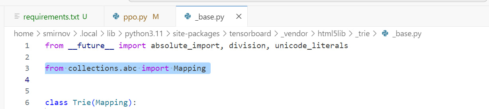

## Federated PPO

### Описание флагов

**--n-agents (int)**: число агентов (может быть один)

**--comm-matrix-config (str)**: путь до матрицы коммуникаций, задаётся json-ом ([пример](comm_matrices/4_agents.json))

**--local-updates (int)**: число циклов локальных обновлений, прежде чем агенты сообщат друг другу об обновлённых весах

**--num-envs (int)**: число сред, в которых каждый из агентов учится параллельно

**--num-steps (int)**: число шагов, которое агенты делают в каждой из своих сред. Таким образом, в рамках одного "policy rollout" мы получаем num_steps * num_envs = batch_size точек в replay buffer для обучения каждого из агентов 

**--num-minibatches (int)**: число минибатчей, на которые мы делим батч для "policy rollout" (см. флаг **--num-steps**)

**--update-epochs (int)**: сколько раз мы просмотрим весь replay buffer целиком во время обучения

**--use-comm-penalty (bool)**: добавляем в лосс каждого из агентов сумму из kl-дивергенций с агентами-соседями или нет

**--penalty-coeff (float)**: коэффициент регуляризации для суммы kl-дивергенций (см. флаг **--use-comm-penalty**)

**--use-clipping (bool)**: используем клиппинг в лоссе или KL-penalty (a.k.a. adaptive loss)

**--clip-coef (float)**: коэффициент регуляризации для клиппинга в функции потерь (см. флаг **--use-clipping**)

**--ent-coef (float)**: коэффициент регуляризации для слагаемого entropy bonus в функции потерь

**--vf-coef (float)**: коэффициент регуляризации для слагаемого value function в функции потерь

**--anneal-lr**: todo

**--gae**: todo

**--gamma**: todo

**--gae-lambda**: todo

**--norm-adv**: todo

**--clip-vloss**: todo

**--max-grad-norm**: todo

**--target-kl**: todo


### Детали реализации:

Видео [здесь](https://www.youtube.com/watch?v=MEt6rrxH8W4&ab_channel=Weights%26Biases)

Соответствующая [статья](https://iclr-blog-track.github.io/2022/03/25/ppo-implementation-details/)


### How to run

1. В первом окне терминала запускаем процесс обучения следующей командой
    ```
    python3 -m federated_ppo.main --total-timesteps=500000 --n-agents=2 --local-updates=16 --num-envs=4 --exp-description="n_agents = 2, local-updates=16" --comm-coeff=10
    ```

2. Во втором окне запускаем тензорборд для визуализации результатов обучения
    ```
    tensorboard --logdir runs
    ```

    **Пример:**

    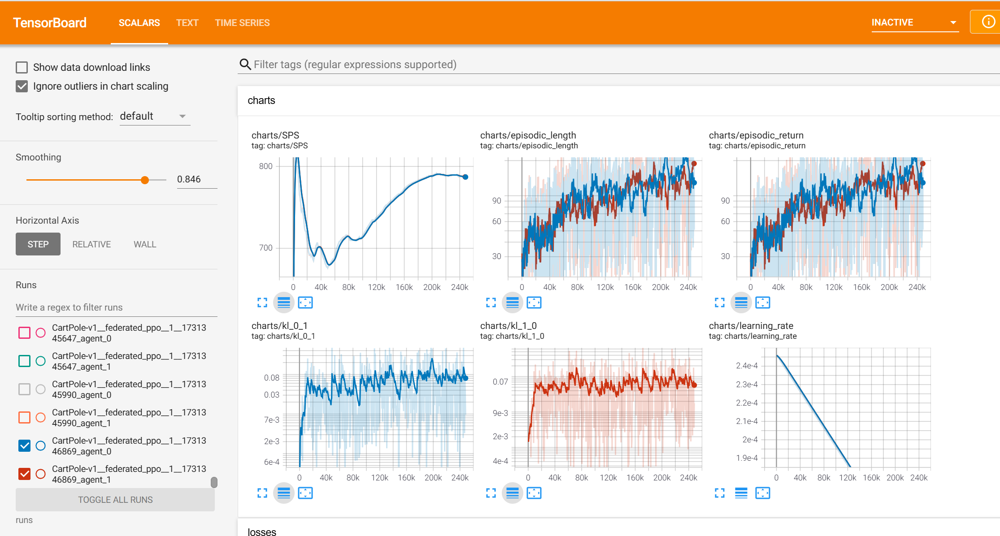


### Логирование статистик

Интересно было посмотреть на вклад каждого из слагаемых в итоговый лосс, на который обучаются агенты. Получилось, что для калибровки этих слагаемых до примерно одного порядка нужно задать параметр *vf-coef = 0.001* вместо 0.5 по умолчанию.

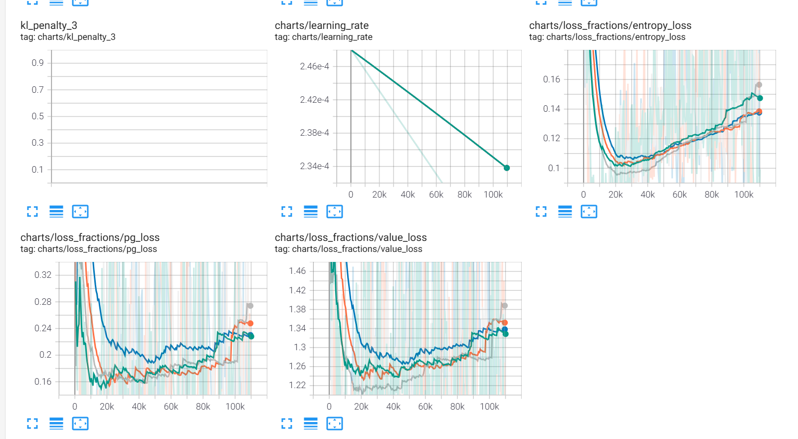

Характер изменения перфоманса в процессе обучения также изменился:

1. До масштабирования слагаемых в лоссе:
    ```
    python3 -m federated_ppo.main --total-timesteps=1000000 --n-agents=4 --local-updates=16 --num-envs=4 --comm-matrix-config="comm_matrices/4_agents.json" --use-clipping=True
    ```

    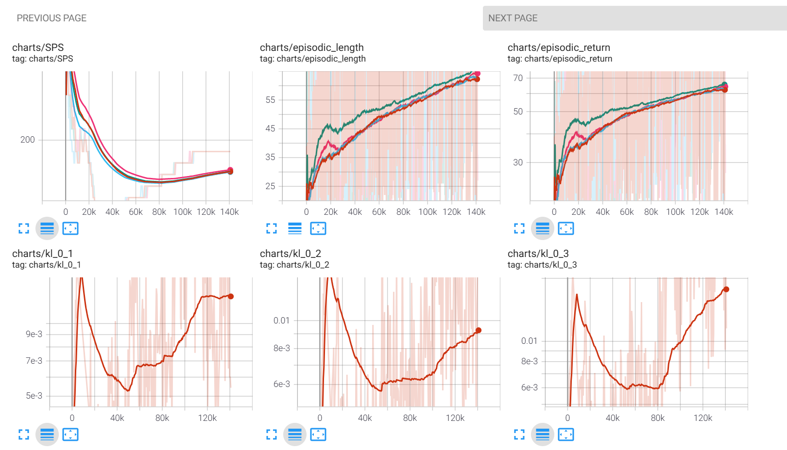

2. После масштабирования слагаемых:
    ```
    python3 -m federated_ppo.main --total-timesteps=1000000 --n-agents=4 --local-updates=16 --num-envs=4 --comm-matrix-config="comm_matrices/4_agents.json" --use-clipping=True --vf-coef=0.001
    ```

    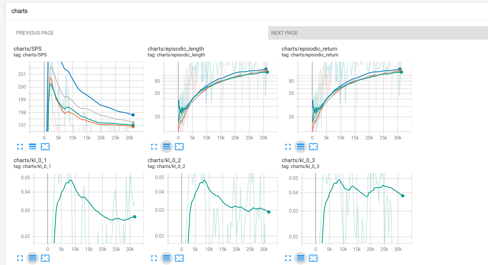

Таким образом, с правильно подобранными коэффициентами для каждого из слагаемых в лоссе мы получаем лучшие результаты. Объединённые выше графики:

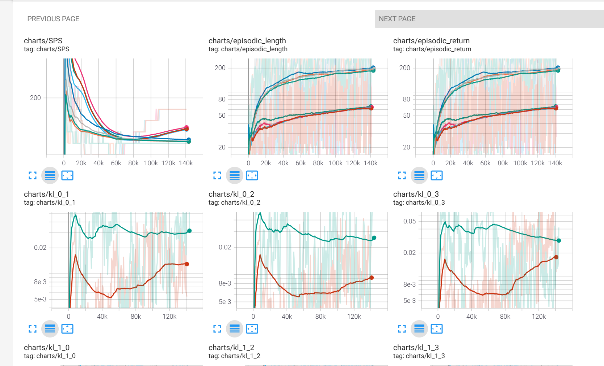

Причём у конфигурации с масштабированием даже без сглаживания график награды за эпизод проходит почти по нижней границе графика, когда сглаживание есть, в отличие от второго сетапа, у которого соответствующий график слишком шумный.

Полученные графики соответствуют по своему поведению и масштабу тем, что представлены в исходной статье по имплементации PPO: [classic control experiments](https://wandb.ai/vwxyzjn/ppo-details/reports/Matching-the-metrics--VmlldzoxMzY5OTMy).

### Факапы

Изначально я по ошибке считал kl-дивергенцию без подсчёта градиентов:

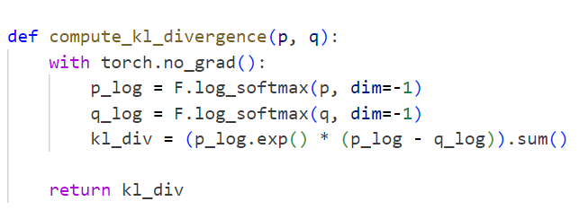

После того, как градиент начал считаться по этим вычислениям, получилась следующая картина:

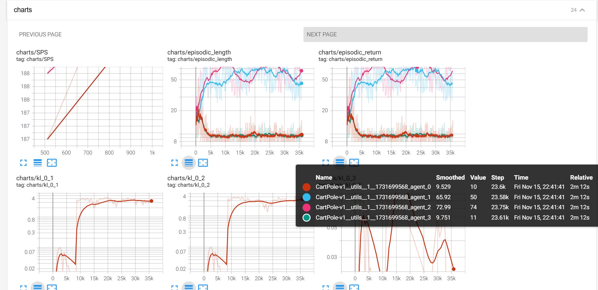

Запуск этого обучения:

    python3 -m federated_ppo.main --total-timesteps=1000000 --n-agents=4 --local-updates=16 --num-envs=4 --comm-matrix-config="comm_matrices/4_agents.json" --use-clipping=True --vf-coef=0.001

То есть красный и зелёный агенты "учатся" получать награду меньше и "притягиваются" друг к другу, хотя матрица коммуникаций следующая: (0, 1), (1, 0): 100 и (2, 3), (3, 2): 100. Ожидается, что, наоборот, 0-й агент будет сближаться с 1-м, а 2-й с третьим.

Если выставить вместо 100 коэффициент 10 или 1, получается следующее:

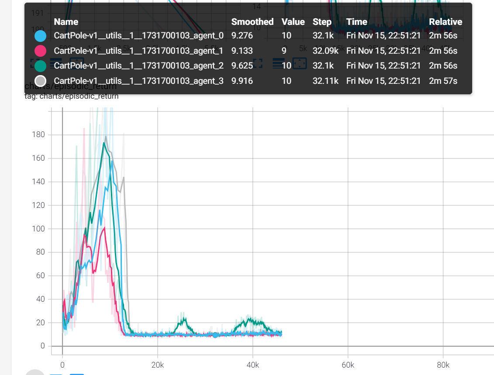

И так все последующие запуски.

**Проблема:** вычитал сумму дивергенций из лосса, а не прибавлял.

Запуски с коэф-тами 1 и 100 (у первого награда выше):

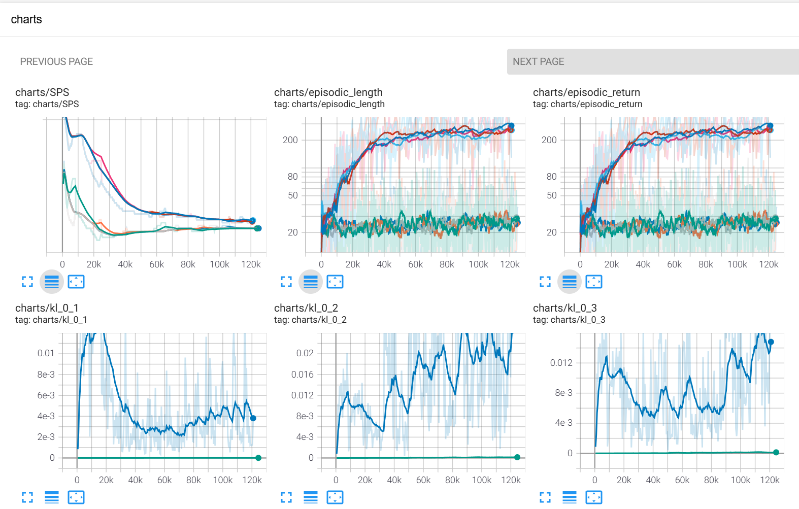

То есть большой вес в матрице коммуникаций сильно регуляризует сумму kl-дивергенций и потому агенты учатся хуже $-$ нужно масштабировать коэф-ты регуляризации.

- Ограничение на максимальную длину эпизода

    Уберём сглаживание и увидим следующую картину:

    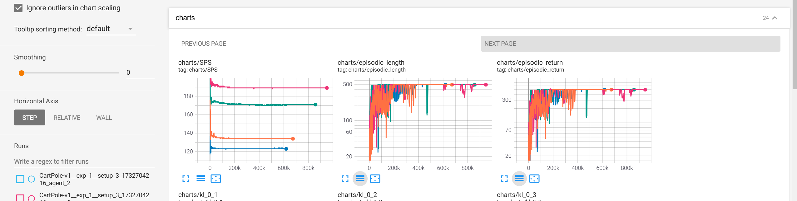

### Эксперименты

#### Experiment 1

Cетап 1 (клиппинг с суммой KL-дивергенций):

    python3 -m federated_ppo.main --total-timesteps=1000000 --n-agents=4 --local-updates=16 --num-envs=4 --comm-matrix-config="comm_matrices/4_agents.json" --vf-coef=0.001 --exp-name=exp_1 --setup-id=setup_1 --use-clipping=True --use-comm-penalty=True

Cетап 2 (клиппинг без суммы KL-дивергенций):

    python3 -m federated_ppo.main --total-timesteps=1000000 --n-agents=4 --local-updates=16 --num-envs=4 --comm-matrix-config="comm_matrices/4_agents.json" --vf-coef=0.001 --exp-name=exp_1 --setup-id=setup_2 --setup-id=setup_2 --use-clipping=True --use-comm-penalty=False

Сетап 3 (сумма KL-дивергенций без клиппинги):

    python3 -m federated_ppo.main --total-timesteps=1000000 --n-agents=4 --local-updates=16 --num-envs=4 --comm-matrix-config="comm_matrices/4_agents.json" --vf-coef=0.001 --exp-name=exp_1 --setup-id=setup_3 --use-clipping=False --use-comm-penalty=True

Сетап 4 (без суммы KL-дивергенций и клиппинга):

    python3 -m federated_ppo.main --total-timesteps=1000000 --n-agents=4 --local-updates=16 --num-envs=4 --comm-matrix-config="comm_matrices/4_agents.json" --vf-coef=0.001 --exp-name=exp_1 --setup-id=setup_4 --use-clipping=False --use-comm-penalty=False

**Замечание.** Без клиппинга означает, что используется Adaptive KL Loss — Kl-дивергенция текущего и предыдущего распределения стратегии.

**Результат:**

- без сглаживания

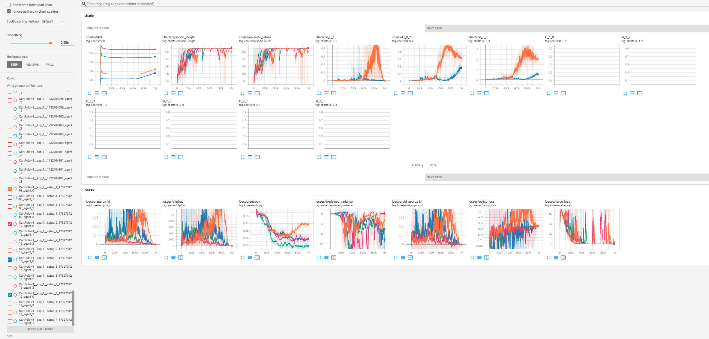

- со сглаживанием

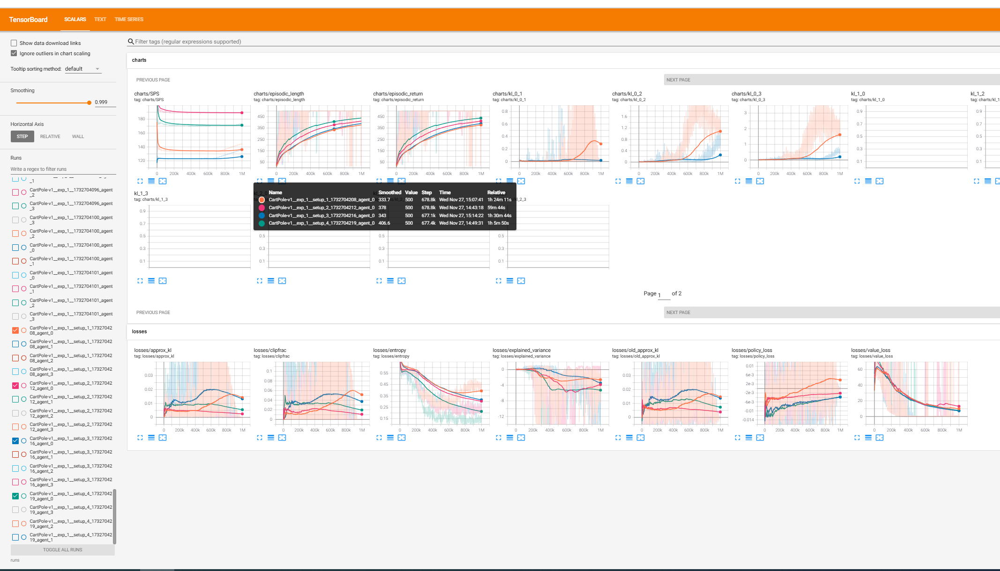

**Вывод:** 2 и 4 сетапы учатся лучше, если сглаживать соответствующие графики обучения. То есть с суммой KL-дивергенций обучение идёт медленнее. Результат соответствует ожиданиям, т.к. сумма KL-дивергенций должна улучшать устойчивость/робастность обучения. Вклад суммы KL-дивергенций мы будем оценивать при обучении агентов в гетерогенных средах.


#### Experiment 2

Сетап 1 (клиппинг без суммы KL-дивергенций, 1024 локальных апдейтов):

    python3 -m federated_ppo.main --total-timesteps=1000000 --n-agents=4 --local-updates=1024 --num-envs=4 --comm-matrix-config="comm_matrices/4_agents.json"  --vf-coef=0.001 --exp-name=exp_2 --setup-id=setup_1 --use-clipping=True --use-comm-penalty=False

Сетап 2 (клиппинг без суммы KL-дивергенций, 256 локальных апдейтов):

    python3 -m federated_ppo.main --total-timesteps=1000000 --n-agents=4 --local-updates=256 --num-envs=4 --comm-matrix-config="comm_matrices/4_agents.json"  --vf-coef=0.001 --exp-name=exp_2 --setup-id=setup_2 --use-clipping=True --use-comm-penalty=False

Сетап 3 (клиппинг без суммы KL-дивергенций, 16 локальных апдейтов):

    python3 -m federated_ppo.main --total-timesteps=1000000 --n-agents=4 --local-updates=16 --num-envs=4 --comm-matrix-config="comm_matrices/4_agents.json"  --vf-coef=0.001 --exp-name=exp_2 --setup-id=setup_3 --use-clipping=True --use-comm-penalty=False

**Результат:**

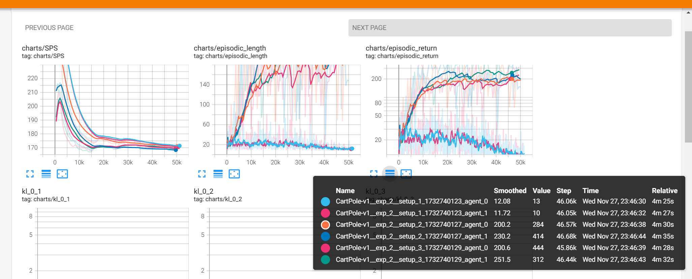

**Замечание.** Это не означает, что агенты лучше учатся, из-за того что они обмениваются друг с другом информацией, поскольку выставлен флаг *--use-comm-penalty=False*. 

**Вывод:** Из того, что явно зависит от числа локальных шагов — это learning rate. Мы его логгируем. Заметим, что в трёх сетапах разница следующая:

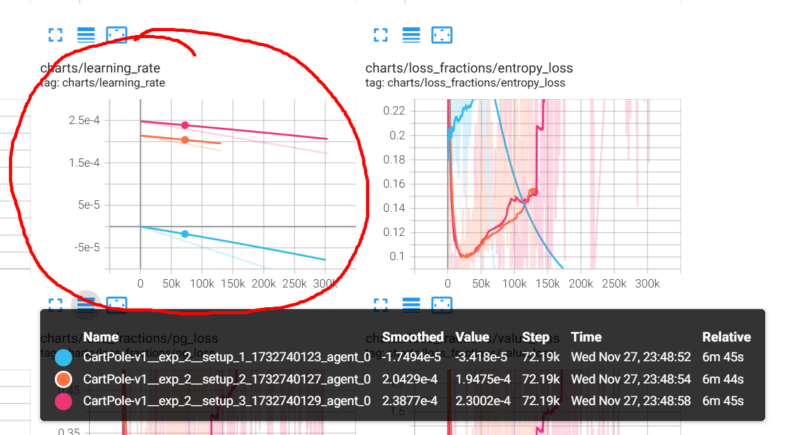

Видим, что lr уходит в отрицательные значения — это неправильно по определению градиентного спуска, то есть противоречит основной теореме мат. анализа. Обработаем этот кейс в коде. Запустим третий аналогичный эксп, но уже с использованием суммы KL-дивергенций, то есть агенты будут обмениваться друг с другом своими распределениями через каждые local_updates локальных обнавлений.


#### Experiment 3

Сетап 1 (клиппинг с суммой KL-дивергенций, 576 локальных апдейтов):

    python3 -m federated_ppo.main --total-timesteps=1000000 --n-agents=4 --local-updates=576 --num-envs=4 --comm-matrix-config="comm_matrices/4_agents.json"  --vf-coef=0.001 --exp-name=exp_3 --setup-id=setup_1 --use-clipping=True --use-comm-penalty=True

Сетап 2 (клиппинг с суммой KL-дивергенций, 128 локальных апдейтов):

    python3 -m federated_ppo.main --total-timesteps=1000000 --n-agents=4 --local-updates=128 --num-envs=4 --comm-matrix-config="comm_matrices/4_agents.json"  --vf-coef=0.001 --exp-name=exp_3 --setup-id=setup_2 --use-clipping=True --use-comm-penalty=True

Сетап 3 (клиппинг с суммой KL-дивергенций, 16 локальных апдейтов):

    python3 -m federated_ppo.main --total-timesteps=1000000 --n-agents=4 --local-updates=16 --num-envs=4 --comm-matrix-config="comm_matrices/4_agents.json"  --vf-coef=0.001 --exp-name=exp_3 --setup-id=setup_3 --use-clipping=True --use-comm-penalty=True


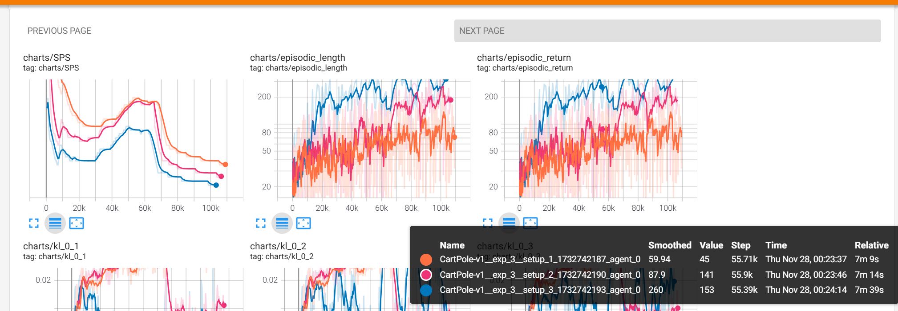

**Вывод:** чем чаще агенты обмениваются друг с другом информацией, тем лучше идёт обучение.


#### Experiment 4

По сути, аналог второго эксперимента, но с фиксом отрицательного lr. Ожидаем, что сильной разницы между сетапами не будет (в отличие от третьего эксперимента).

Сетап 1 (клиппинг без суммы KL-дивергенций, 576 локальных апдейтов):

    python3 -m federated_ppo.main --total-timesteps=1000000 --n-agents=4 --local-updates=576 --num-envs=4 --vf-coef=0.001 --exp-name=exp_4 --setup-id=setup_1 --use-clipping=True --use-comm-penalty=False

Сетап 2 (клиппинг без суммы KL-дивергенций, 128 локальных апдейтов):

    python3 -m federated_ppo.main --total-timesteps=1000000 --n-agents=4 --local-updates=128 --num-envs=4 --vf-coef=0.001 --exp-name=exp_4 --setup-id=setup_2 --use-clipping=True --use-comm-penalty=False

Сетап 3 (клиппинг без суммы KL-дивергенций, 16 локальных апдейтов):

    python3 -m federated_ppo.main --total-timesteps=1000000 --n-agents=4 --local-updates=16 --num-envs=4 --vf-coef=0.001 --exp-name=exp_4 --setup-id=setup_3 --use-clipping=True --use-comm-penalty=False

**Результат:**

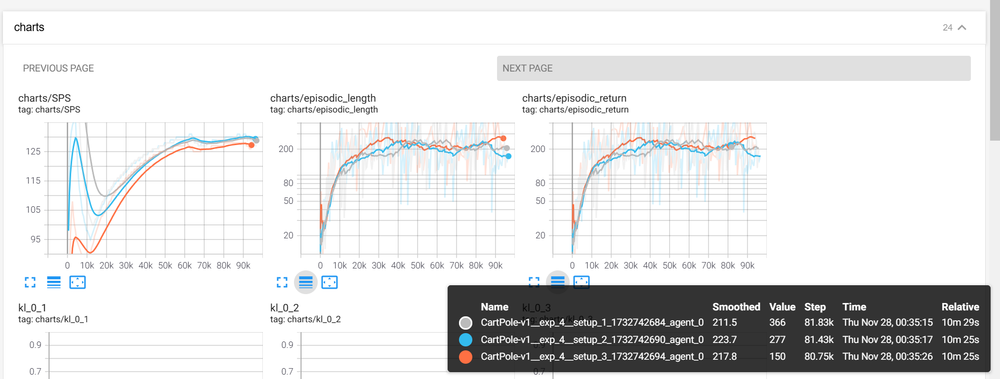

**Вывод:** наши ожидания подтвердились. В случае, если агенты не обмениваются информацией друг с другом (если нет суммы KL-дивергенций в лоссе), качество обучения не зависит от числа локальных обновлений.