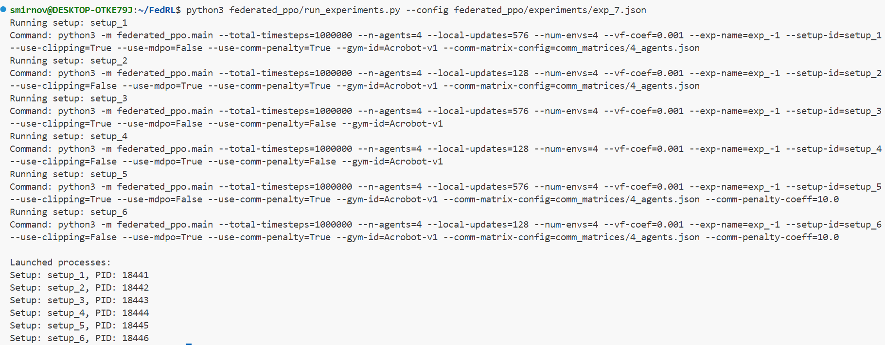

# FedRL

## Federated PPO

### Objectives

PPO article: https://arxiv.org/pdf/1707.06347

MDPO article: https://arxiv.org/pdf/2005.09814

#### Main objective
$$L_t^{CLIP+VF+S}(\theta) = \hat{\mathbb{E}}_t \left[ L_t^{CLIP}(\theta) - c_1 L_t^{VF}(\theta) + c_2 S[\pi_\theta](s_t) \right]$$

#### $L_t^{CLIP}(\theta)$ variations

1. No clipping or penalty:
$$L_t(\theta) = r_t(\theta)\hat{A}_t$$

2. Clipping (**note:** equals to $L_t^{CLIP}(\theta)$):
$$L_t(\theta) = \min\left(r_t(\theta)\hat{A}_t, \text{clip}(r_t(\theta), 1 - \epsilon, 1 + \epsilon)\hat{A}_t\right)$$

3. KL penalty (fixed or adaptive):

- No communication:
$$L_t(\theta) = r_t(\theta)\hat{A}_t - \beta \text{KL}[\pi_{\theta_{\text{old}}}, \pi_\theta]$$

- With communication:
$$L_t(\theta) = r_t(\theta) \hat{A}_t - \beta \, \text{KL}\left[ \sum_{i=1}^n w_i \pi_{\theta_i}, \pi_\theta \right]$$


4. MDPO:

- No communication:
$$L_t(\theta) = r_t(\theta)\hat{A}_t - \beta \text{KL}[\pi_\theta, \pi_{\theta_{\text{old}}}]$$

- With communication:
$$L_t(\theta) = r_t(\theta) \hat{A}_t - \beta \, \text{KL}\left[ \pi_\theta, \sum_{i=1}^n w_i \pi_{\theta_i} \right]$$


### Описание флагов

Флаги описаны здесь:
```
python3 federated_ppo/describe_flags.py
```

### Детали реализации:

Видео [здесь](https://www.youtube.com/watch?v=MEt6rrxH8W4&ab_channel=Weights%26Biases)

Соответствующая [статья](https://iclr-blog-track.github.io/2022/03/25/ppo-implementation-details/)


### How to run

В начале запускаем тензорборд для визуализации результатов обучения:

```
tensorboard --logdir runs
```

#### Запуск одного сетапа

В первом окне терминала запускаем процесс обучения следующей командой

```
python3 -m federated_ppo.main --total-timesteps=500000 --n-agents=2 --local-updates=16 --num-envs=4 --exp-description="n_agents = 2, local-updates=16" --comm-coeff=10
```

**Пример:**


#### Запуск эксперимента с несколькими сетапами

В папке *federated_ppo/experiments* хранятся конфигурации сетапов в формате json. Для запуска эксперимента введите

```
python3 federated_ppo/run_experiments.py --config federated_ppo/experiments/<exp_name>.json
```

Программа выведет запущенные процессы под каждый сетап:



**Замечание.** Вывод этих процессов перенаправляется в директорию *federated_ppo/logs*.

Чтобы убить эти процессы, введите

```
kill <pid_1> <pid_2> ... <pid_n>
```

## Установка зависимостей
Создание среды с установкой списка пакетов:
```sh
conda create --name fedrl --file spec-file.txt
```

Список пакетов, установленных в текущей conda-среде:
```sh
conda list --explicit > spec-file.txt
```

Активация среды:
```
conda activate fedrl
```

Добавить в ~/.bashrc строчку
```
export PROTOCOL_BUFFERS_PYTHON_IMPLEMENTATION=python```
```

Для установки minigrid, gym и tensorboard необходимо воспользоваться менеджером pip:
```sh
pip install minigrid==3.0.0
pip install gym==0.26.2
pip install tensorboard==2.5.0
pip install numpy==1.23.5
```
или
```sh
pip install -r requirements.txt
```

Поскольку библиотека minigrid работает с gymnasium, а исходники статьи PPO написаны на gym, необходимо запатчить исходники minigrid и перейти на gym:

1.  В файле
    ```sh
    /home/smirnovvl/miniconda3/envs/fedrl/lib/python3.11/site-packages/minigrid/minigrid_env.py
    ```

    заменить

    ```python
    import gymnasium as gym
    from gymnasium import spaces
    from gymnasium.core import ActType, ObsType
    ```

    на

    ```python
    import gym
    from gym import spaces
    from gym.core import ActType, ObsType
    ```

2.  В файле
    ```
    /home/smirnovvl/miniconda3/envs/fedrl/lib/python3.11/site-packages/minigrid/__init__.py
    ```

    заменить импорт

    ```python
    from gymnasium.envs.registration import register
    ```

    на

    ```python
    from gym.envs.registration import register
    ```

3.  В файле
    ```
    /home/smirnovvl/miniconda3/envs/fedrl/lib/python3.11/site-packages/minigrid/core/mission.py
    ```

    заменить импорт

    ```python
    from gymnasium import spaces
    from gymnasium.utils import seeding
    ```

    на

    ```python
    from gym import spaces
    from gym.utils import seeding
    ```

4.  В файле

    ```
    /home/smirnovvl/miniconda3/envs/fedrl/lib/python3.11/site-packages/minigrid/wrappers.py
    ```

    заменить импорт

    ```
    import gymnasium as gym
    from gymnasium import logger, spaces
    from gymnasium.core import ActionWrapper, ObservationWrapper, ObsType, Wrapper
    ```

    на

    ```
    import gym
    from gym import logger, spaces
    from gym.core import ActionWrapper, ObservationWrapper, ObsType, Wrapper
    ```

### Сохранение записей эпизодов

При передаче флага ```--capture-video``` придётся запатчить [монитор](/home/smirnov/FedRL/patches/site-packages/wandb/integration/gym/__init__.py)

### Перенести логи с одной тачки на другую

```sh
scp -r experiments/23_02_2025_2 smirnovvl@beleriand.velkerr.ru:~/exp
```