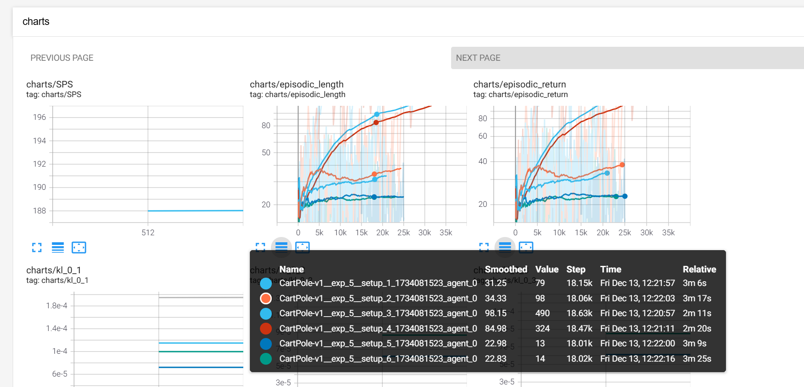

# FedRL

## ppo.py

Решения возможных проблем при запуске программы:

- прописать в терминале ```export PROTOCOL_BUFFERS_PYTHON_IMPLEMENTATION=python``` (добавить в ~/.bashrc, чтобы не мучаться каждый раз)
- при передаче флага ```--capture-video``` придётся запатчить [монитор](/home/smirnov/FedRL/patches/site-packages/wandb/integration/gym/__init__.py)
- при запуске тензорборды инструкцией ```tensorboard --logdir runs``` придётся запатчить следующий файл: 


## Federated PPO

### Описание флагов

Флаги описаны здесь:
```
python3 federated_ppo/describe_flags.py
```

### Детали реализации:

Видео [здесь](https://www.youtube.com/watch?v=MEt6rrxH8W4&ab_channel=Weights%26Biases)

Соответствующая [статья](https://iclr-blog-track.github.io/2022/03/25/ppo-implementation-details/)


### How to run

В начале запускаем тензорборд для визуализации результатов обучения:

```
tensorboard --logdir runs
```

#### Запуск одного сетапа

В первом окне терминала запускаем процесс обучения следующей командой

```
python3 -m federated_ppo.main --total-timesteps=500000 --n-agents=2 --local-updates=16 --num-envs=4 --exp-description="n_agents = 2, local-updates=16" --comm-coeff=10
```

**Пример:**


#### Запуск эксперимента с несколькими сетапами

В папке *federated_ppo/experiments* хранятся конфигурации сетапов в формате json. Для запуска эксперимента введите

```
python3 federated_ppo/run_experiments.py --config federated_ppo/experiments/<exp_name>.json
```

Программа выведет запущенные процессы под каждый сетап:


**Замечание.** Вывод этих процессов перенаправляется в директорию *federated_ppo/logs*.

Чтобы убить эти процессы, введите

```
kill <pid_1> <pid_2> ... <pid_n>
```


### Логирование статистик

Интересно было посмотреть на вклад каждого из слагаемых в итоговый лосс, на который обучаются агенты. Получилось, что для калибровки этих слагаемых до примерно одного порядка нужно задать параметр *vf-coef = 0.001* вместо 0.5 по умолчанию.


Характер изменения перфоманса в процессе обучения также изменился:

1. До масштабирования слагаемых в лоссе:
    ```
    python3 -m federated_ppo.main --total-timesteps=1000000 --n-agents=4 --local-updates=16 --num-envs=4 --comm-matrix-config="comm_matrices/4_agents.json" --use-clipping=True
    ```

    

2. После масштабирования слагаемых:
    ```
    python3 -m federated_ppo.main --total-timesteps=1000000 --n-agents=4 --local-updates=16 --num-envs=4 --comm-matrix-config="comm_matrices/4_agents.json" --use-clipping=True --vf-coef=0.001
    ```

    

Таким образом, с правильно подобранными коэффициентами для каждого из слагаемых в лоссе мы получаем лучшие результаты. Объединённые выше графики:


Причём у конфигурации с масштабированием даже без сглаживания график награды за эпизод проходит почти по нижней границе графика, когда сглаживание есть, в отличие от второго сетапа, у которого соответствующий график слишком шумный.

Полученные графики соответствуют по своему поведению и масштабу тем, что представлены в исходной статье по имплементации PPO: [classic control experiments](https://wandb.ai/vwxyzjn/ppo-details/reports/Matching-the-metrics--VmlldzoxMzY5OTMy).

### Факапы

Изначально я по ошибке считал kl-дивергенцию без подсчёта градиентов:


После того, как градиент начал считаться по этим вычислениям, получилась следующая картина:


Запуск этого обучения:

    python3 -m federated_ppo.main --total-timesteps=1000000 --n-agents=4 --local-updates=16 --num-envs=4 --comm-matrix-config="comm_matrices/4_agents.json" --use-clipping=True --vf-coef=0.001

То есть красный и зелёный агенты "учатся" получать награду меньше и "притягиваются" друг к другу, хотя матрица коммуникаций следующая: (0, 1), (1, 0): 100 и (2, 3), (3, 2): 100. Ожидается, что, наоборот, 0-й агент будет сближаться с 1-м, а 2-й с третьим.

Если выставить вместо 100 коэффициент 10 или 1, получается следующее:


И так все последующие запуски.

**Проблема:** вычитал сумму дивергенций из лосса, а не прибавлял.

Запуски с коэф-тами 1 и 100 (у первого награда выше):


То есть большой вес в матрице коммуникаций сильно регуляризует сумму kl-дивергенций и потому агенты учатся хуже $-$ нужно масштабировать коэф-ты регуляризации.

- Ограничение на максимальную длину эпизода

    Уберём сглаживание и увидим следующую картину:

    

## Эксперименты

### Experiment 1

- Cетап 1: клиппинг с суммой KL-дивергенций
- Cетап 2: клиппинг без суммы KL-дивергенций
- Сетап 3: сумма KL-дивергенций без клиппинги
- Сетап 4: без суммы KL-дивергенций и клиппинга

**Замечание.** Без клиппинга означает, что используется Adaptive KL Loss — Kl-дивергенция текущего и предыдущего распределения стратегии.

```
python3 federated_ppo/run_experiments.py --config federated_ppo/experiments/exp_1.json
```

**Результат:**

- без сглаживания


- со сглаживанием


**Вывод:** 2 и 4 сетапы учатся лучше, если сглаживать соответствующие графики обучения. То есть с суммой KL-дивергенций обучение идёт медленнее. Результат соответствует ожиданиям, т.к. сумма KL-дивергенций должна улучшать устойчивость/робастность обучения. Вклад суммы KL-дивергенций мы будем оценивать при обучении агентов в гетерогенных средах.


### Experiment 2

- Сетап 1: клиппинг без суммы KL-дивергенций, 1024 локальных апдейтов
- Сетап 2: клиппинг без суммы KL-дивергенций, 256 локальных апдейтов
- Сетап 3: клиппинг без суммы KL-дивергенций, 16 локальных апдейтов

```
python3 federated_ppo/run_experiments.py --config federated_ppo/experiments/exp_2.json
```

**Результат:**


**Замечание.** Это не означает, что агенты лучше учатся, из-за того что они обмениваются друг с другом информацией, поскольку выставлен флаг *--use-comm-penalty=False*. 

**Вывод:** Из того, что явно зависит от числа локальных шагов — это learning rate. Мы его логгируем. Заметим, что в трёх сетапах разница следующая:


Видим, что lr уходит в отрицательные значения — это неправильно по определению градиентного спуска, то есть противоречит основной теореме мат. анализа. Обработаем этот кейс в коде. Запустим третий аналогичный эксп, но уже с использованием суммы KL-дивергенций, то есть агенты будут обмениваться друг с другом своими распределениями через каждые local_updates локальных обнавлений.


### Experiment 3

В отличие от второго экспа, здесь агенты обмениваются информацией.

- Сетап 1: клиппинг с суммой KL-дивергенций, 576 локальных апдейтов
- Сетап 2: клиппинг с суммой KL-дивергенций, 128 локальных апдейтов
- Сетап 3: клиппинг с суммой KL-дивергенций, 16 локальных апдейтов

```
python3 federated_ppo/run_experiments.py --config federated_ppo/experiments/exp_3.json
```


**Вывод:** чем чаще агенты обмениваются друг с другом информацией, тем лучше идёт обучение.


### Experiment 4

По сути, аналог второго эксперимента, но с фиксом отрицательного lr. Ожидаем, что сильной разницы между сетапами не будет (в отличие от третьего эксперимента).

- Сетап 1: клиппинг без суммы KL-дивергенций, 1024 локальных апдейтов
- Сетап 2: клиппинг без суммы KL-дивергенций, 256 локальных апдейтов
- Сетап 3: клиппинг без суммы KL-дивергенций, 16 локальных апдейтов

```
python3 federated_ppo/run_experiments.py --config federated_ppo/experiments/exp_4.json
```

**Результат:**


**Вывод:** наши ожидания подтвердились. В случае, если агенты не обмениваются информацией друг с другом (если нет суммы KL-дивергенций в лоссе), качество обучения не зависит от числа локальных обновлений.


### Experiment 5

По сути, MDPO - это PPO с KL Penalty без последних двух слагаемых в лоссе:

**Замечание.** Лосс в алгоритме MDPO содержит в себе Value function loss, поэтому эксперимент 5 некорректен.


, где


- Сетап 1: PPO с клиппингом, с суммой KL-дивергенций (comm-penalty-coeff = 1.0)
- Сетап 2: MDPO, с суммой KL-дивергенций (comm-penalty-coeff = 1.0)
- Сетап 3: PPO с клиппингом, без суммы KL-дивергенций
- Сетап 4: MDPO, без суммы KL-дивергенций
- Сетап 5: PPO с клиппингом, с суммой KL-дивергенций (comm-penalty-coeff = 10.0)
- Сетап 6: MDPO, с суммой KL-дивергенций (comm-penalty-coeff = 10.0)

```
python3 federated_ppo/run_experiments.py --config federated_ppo/experiments/exp_5.json
```

**Вывод:** агенты обучаются медленнее, если добавлять сумму KL-дивергенций. Причём с увеличением коэффициента регуляризации *comm-penalty-coeff* обучение замедляется.




### Experiment 6

Первые 4 сетапа эксперимента 5, но в среде Acrobot-v1.

- Сетап 1: PPO с клиппингом, с суммой KL-дивергенций (comm-penalty-coeff = 1.0)
- Сетап 2: MDPO, с суммой KL-дивергенций (comm-penalty-coeff = 1.0)
- Сетап 3: PPO с клиппингом, без суммы KL-дивергенций
- Сетап 4: MDPO, без суммы KL-дивергенций

```
python3 federated_ppo/run_experiments.py --config federated_ppo/experiments/exp_6.json
```


**Вывод:** только 3 и 4 сетапы (PPO с клиппингом и MDPO) позволяют за 1 миллион итераций выйти на какую-то не нулевую награду. Причём сетап 3 (PPO с клиппингом) обучается быстрее, чем сетап 4 (MDPO).

## Среды Minigrid

Туторил по созданию кастомной среды: [ссылка](https://minigrid.farama.org/content/create_env_tutorial/)

Запуск первого обучения:

```
python3 -m federated_ppo.main --total-timesteps=1000000 --n-agents=4 --local-updates=16 --num-envs=4 --vf-coef=0.001 --use-clipping=True --use-comm-penalty=False --gym-id="MiniGrid-Empty-16x16-v0" --capture-video
```

### Experiment *

Здесь я проверил различные сетапы по обучению агентов в лабиринтах, а точнее в средах MiniGrid-SimpleCrossing и MiniGrid-LavaCrossing.

Архитектура FeatureExtractor'а:


5 сетапов:

- Сетап 1: SimpleCrossing с CNN с активацией Tanh
- Сетап 2: SimpleCrossing только с полносвязным слоем с активацией Tanh
- Сетап 3: LavaCrossing только с полносвязным слоем с активацией Tanh
- Сетап 4: LavaCrossing с CNN с активацией Tanh
- Сетап 5: LavaCrossing с CNN с активацией ReLU

Другие параметры: num-envs=8


**Выводы:**
- Свёрточная сеть с активацией Tanh обучается быстрее, чем с активацией ReLU
- Для обучения агентов в среде LavaCrossing необходимо использование свёрток, т.к. с исключительно полносвязным слоем модель показывает результаты на порядок хуже (можно сказать, не обучается)
- В среде SimpleCrossing агенты обучаются медленнее с использованием свёрток, чем просто с линейным слоем. Однако, в последних эпизодах обучения свёртки показывают более стабильный результат, в то время как модель с исключительно FCN более шумная
- Все сетапы, кроме 3, в итоге приближаются к значению 0.95 по episodic return

### Experiment 7

Используем CNN с функцией активацией Tanh в различных средах SimpleCrossing:

- Сетап 1: MiniGrid-SimpleCrossingS9N1-v0
- Сетап 2: MiniGrid-SimpleCrossingS9N2-v0
- Сетап 3: MiniGrid-SimpleCrossingS9N3-v0


**Выводы:**
- Чем больше стенок в лабиринте, тем быстрее обучается агент
- Итоговое значение награды за эпизод так же около 0.95

### Experiment 8

Используем CNN с функцией активацией Tanh в различных средах LavaCrossing:

- Сетап 1: MiniGrid-LavaCrossingS9N1-v0
- Сетап 2: MiniGrid-LavaCrossingS9N2-v0
- Сетап 3: MiniGrid-LavaCrossingS9N3-v0


**Выводы:**
- Агенты успешно обучаются в средах с 1 и 3 линиями из лавы, причём для последней среды требуется больше времени для обучения
- В среде с двумя линиями из лавы агент за 5 миллионов шагов не обучился 


### Experiment 9

Используем CNN с функцией активацией Tanh в среде MiniGrid-LavaCrossingS9N2-v0 с различным числом параллельных сред (--num-envs) для обучения агента.

- Сетап 1: num-envs=4
- Сетап 2: num-envs=16
- Сетап 3: num-envs=32


**Выводы:**
- Из рассмотренных сетапов обучение проходит успешно только во втором, когда мы кладём в батч эпизоды из 16 параллельных сред

# Теория

## Градиент функции лосса для MDPO

Для функции лосса:

$$
L_{\text{policy}} = - \mathbb{E}_{s, a} \left[ \frac{\pi_\theta(a|s)}{\pi_{\theta_k}(a|s)} A^{\theta_k}(s, a) \right],
$$

градиент по параметрам $\theta$ можно вычислить следующим образом.

1. Обозначим:
   $$
   r(a|s) = \frac{\pi_\theta(a|s)}{\pi_{\theta_k}(a|s)}.
   $$
   Тогда лосс принимает вид:
   $$
   L_{\text{policy}} = - \mathbb{E}_{s, a} \left[ r(a|s) A^{\theta_k}(s, a) \right].
   $$

2. Градиент по $\theta$:
   $$
   \nabla_\theta L_{\text{policy}} = - \nabla_\theta \mathbb{E}_{s, a} \left[ r(a|s) A^{\theta_k}(s, a) \right].
   $$

3. Используем градиент вероятностного отношения:
   $$
   \nabla_\theta r(a|s) = r(a|s) \nabla_\theta \log \pi_\theta(a|s).
   $$

4. Подставляем $\nabla_\theta r(a|s)$:
$$
\nabla_\theta L_{\text{policy}} = - \mathbb{E}_{s, a} \left[ A^{\theta_k}(s, a) \cdot r(a|s) \cdot \nabla_\theta \log \pi_\theta(a|s) \right].
$$

Или, заменяя $r(a|s)$ обратно:
$$
\nabla_\theta L_{\text{policy}} = - \mathbb{E}_{s, a} \left[ \frac{\pi_\theta(a|s)}{\pi_{\theta_k}(a|s)} A^{\theta_k}(s, a) \cdot \nabla_\theta \log \pi_\theta(a|s) \right].
$$

Финальный градиент:
$$
\nabla_\theta L_{\text{policy}} = - \mathbb{E}_{s, a} \left[ \frac{\pi_\theta(a|s)}{\pi_{\theta_k}(a|s)} \cdot A^{\theta_k}(s, a) \cdot \nabla_\theta \log \pi_\theta(a|s) \right].
$$

Таким образом, это то самое первое слагаемое в градиенте для MDPO:

$$
\nabla_\theta \Psi(\theta, \theta_k) \big|_{\theta = \theta_k^{(i)}} =
\mathbb{E}_{s \sim \rho_{\pi_{\theta_k}}, a \sim \pi_{\theta_k}} \left[
\frac{\pi_{\theta_k^{(i)}}(a|s)}{\pi_{\theta_k}(a|s)} \nabla_\theta \log \pi_{\theta_k^{(i)}}(a|s) A^{\theta_k}(s, a)
\right] 
- \frac{1}{t_k} \mathbb{E}_{s \sim \rho_{\pi_{\theta_k}}} \left[
\nabla_\theta \text{KL}(s; \pi_\theta, \pi_{\theta_k}) \big|_{\theta = \theta_k^{(i)}}
\right]
$$