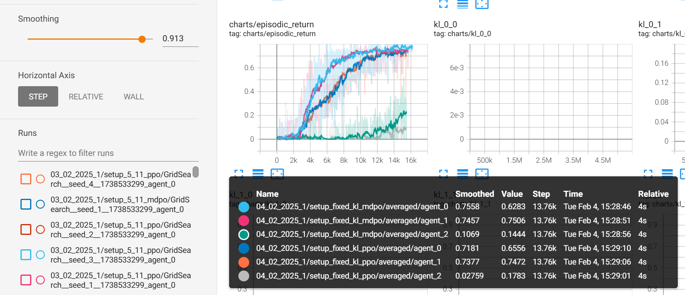

# Experiments

Описаны сетапы за последние две недели, т.к. предыдущие уже не актуальны.

## 03_02_2025_1

Два агента коммуницируют, третий агент учится отдельно: либо с PPO, либо по MDPO. Усреднение по 5 сидам. Результат:

PPO:

MDPO:

**Вывод:** Обнаружили ошибку в подсчёте KL, пофиксили [здесь](https://github.com/RLHF-And-Friends/FedRL/commit/a42e06d3b850032b899a786ddbaa7c8bf9ed3496). Перезапускаем эксп (см. 04_02_2025_1).

## 04_02_2025_1

Пофиксили KL [здесь](https://github.com/RLHF-And-Friends/FedRL/commit/a42e06d3b850032b899a786ddbaa7c8bf9ed3496) и по-умному начали распределять сиды [здесь](https://github.com/RLHF-And-Friends/FedRL/commit/5e3a7ea9ce056bab3cc244c85e35ecf2488758c3).

PPO:

MDPO:

PPO и MDPO на одном графике (MDPO выше):

**Вывод:** Коммуникация позволяет агентам учиться быстрее. С MDPO обучение идёт быстрее, как в одиночном, так и в коммутативном режимах.

## 04_02_2025_2

Такой же эксп как предыдущий, но с 10 сидами и на 10 миллионов итераций (x2).

**Вывод:** 

## 04_02_2025_3

5 миллионов итераций с 10 сидами в NoCustom-среде (предыдущие были в CustomSimpleCrossingS9N2-v0).

**Вывод:** 

## 05_02_2025_1

Здесь мы рассматриваем лабиринты трёх видов:

1. Агент ищет путь из верхнего левого угла в правый нижний

2. Агент ищет путь из правого нижнего угла в левый верхний

3. Агент ищет путь из левого нижнего угла в правый верхний

В каждом из лабиринтов проинициализируем по пять агентов (итого 15 агентов). Далее, взвешивание распределений для использования в KL-дивергенции происходит на основе топ-5 агентов, с которыми скалярное произведение стратегий (вероятностей) наибольшее.

**Замечание.** Здесь же для каждого агента считаем число "непопаданий", то есть ситуаций, когда в эти топ-5 агентов входят соседи из другого лабиринта.

## 05_02_2025_2

Такой же сетап как выше, но взвешиваем только агентов из того же лабиринта на основе их среднего reward'а на момент последней коммуникации.

