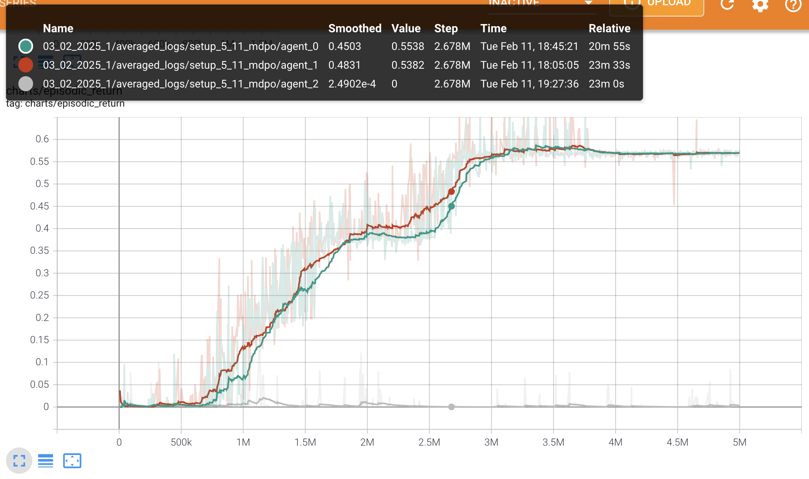
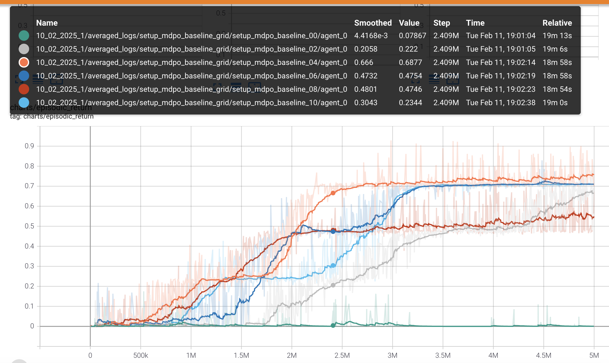

# Experiments

Среды, на которых проводились эксперименты:

- SimpleCrossingS9N2-v0
- LavaCrossingS9N2-v0
- Dynamic-Obstacles
- DistShift2-v0
- DoorKey-6x6-v0
- PutNear-8x8-N3-v0
- FourRooms-v0

## 03_02_2025_1

**Среда:** CustomSimpleCrossingS9N2

Два агента коммуницируют, третий агент учится отдельно: либо с PPO, либо по MDPO. Усреднение по 5 сидам. Результат:

| MDPO  | PPO | PPO and MDPO |
|:-------------:|:-------------:|:-------------:|
|   |   |   |

**Вывод:** Обнаружили ошибку в подсчёте KL, пофиксили [здесь](https://github.com/RLHF-And-Friends/FedRL/commit/a42e06d3b850032b899a786ddbaa7c8bf9ed3496). Перезапускаем эксп (см. 04_02_2025_1).

## 04_02_2025_1

**Среда:** CustomSimpleCrossingS9N2

Пофиксили KL [здесь](https://github.com/RLHF-And-Friends/FedRL/commit/a42e06d3b850032b899a786ddbaa7c8bf9ed3496) и по-умному начали распределять сиды [здесь](https://github.com/RLHF-And-Friends/FedRL/commit/5e3a7ea9ce056bab3cc244c85e35ecf2488758c3).

| MDPO  | PPO | PPO and MDPO |
|:-------------:|:-------------:|:-------------:|
|   |   |   |

**Вывод:** Коммуникация позволяет агентам учиться быстрее. С MDPO обучение идёт быстрее, как в одиночном, так и в коммутативном режимах.

## 04_02_2025_2

**Среда:** CustomSimpleCrossingS9N2

Такой же эксп как предыдущий, но с 10 сидами и на 10 миллионов итераций (x2).

| MDPO  | PPO | PPO and MDPO |
|:-------------:|:-------------:|:-------------:|
|   |   |   |

**Вывод:** пара агентов учится быстрее при обучении с PPO, но третий агент учится быстрее с MDPO. В данном learning rate меняется в два раза медленнее, возможно это и является причиной такого результата.

## 04_02_2025_3

**Среда:** SimpleCrossingS9N2-v0

5 миллионов итераций с 10 сидами в NoCustom-среде (предыдущие были в CustomSimpleCrossingS9N2-v0).

| MDPO  | PPO | PPO and MDPO |
|:-------------:|:-------------:|:-------------:|
|   |   |   |

**Вывод:** Коммуникация позволяет агентам учиться быстрее. С MDPO обучение идёт быстрее в коммутативном режиме, но медленнее, чем с PPO, в одиночном.

## 05_02_2025_1

**Среда:** CustomSimpleCrossingS9N2

Здесь мы рассматриваем лабиринты трёх видов:

1. Агент ищет путь из верхнего левого угла в правый нижний

2. Агент ищет путь из правого нижнего угла в левый верхний

3. Агент ищет путь из левого нижнего угла в правый верхний

В каждом из лабиринтов проинициализируем по три агента (итого 9 агентов). Далее, взвешивание распределений для использования в KL-дивергенции происходит на основе топ-3 агентов, с которыми скалярное произведение стратегий (вероятностей) наибольшее. В том числе обучаем бейзлайн, когда в среде обучается лишь один агент без коммуникаций.

**Замечание.** Здесь же для каждого агента считаем число "непопаданий", то есть ситуаций, когда в эти топ-5 агентов входят соседи из другого лабиринта.

Результаты для PPO:

Бейзлайны для PPO:

**Вывод:** первая и третья группы учатся быстрее в single-режиме, чем с выбором top-3 соседей. В то же время агент из второй группы (правый нижний угол -> левый верхний) почти не учится. 

Результаты для MDPO:

Бейзлайны для MDPO:

**Вывод:** первая и третья группы учатся быстрее в федеративном постановке (с выбором top-3 соседей), чем в single-режиме. В то же время агент из второй группы (правый нижний угол -> левый верхний) почти не учится в single-режиме, однако в федеративной постановке вторая группа учится, но хуже, чем первая и третья группы.

Бейзлайны на одном графике:

**Вывод:** в бейзлайнах PPO и MDPO агент из второй группы не учится, а для агентов из первой и третьей группы бейзлайны учатся быстрее с PPO.

## 05_02_2025_2

**Среда:** CustomSimpleCrossingS9N2

Такой же сетап как выше (05_02_2025_1), но взвешиваем только агентов из того же лабиринта на основе их среднего reward'а на момент последней коммуникации. В том числе обучаем бейзлайн, когда в среде обучается лишь один агент без коммуникаций.

| MDPO  | PPO | PPO and MDPO |
|:-------------:|:-------------:|:-------------:|
|   |   |   |

Видим, что для MDPO и PPO бейзлайны (отдельно обучающиеся агенты) показывают результат хуже, чем в федеративном сетапе. Более того, с MDPO обучение идёт быстрее.

Бейзлайны на одном графике:

Таким образом, MDPO сначала обгоняет PPO, но потом сильно уступает.

## 10_02_2025_1

**Среда:** CustomSimpleCrossingS9N2

Запускаем обучение бейзлайна с различными коэффициентами регуляризации перед KL-термом. (сетка от 0.0 до 1.0 с шагом 0.2).

Результаты для PPO:

То есть для PPO бейзлайн учится лучше всего с коэффициентами 0.4, 0.6 и 0.8 перед KL-термом.

Результаты для MDPO:

Для MDPO бейзлайн учится лучше с коэффициентами 0.4, 0.6 и 1.0 перед KL-термом.

Сравним лучшие результаты PPO и MDPO:

Таким образом, топ бейзлайнов с MDPO учатся лучше, чем топ бейзлайнов с PPO.

## 13_02_2025_1

**Среда:** CustomSimpleCrossingS9N2

Такой же сетап как 05_02_2025_1, но с 12 агентами (добавили ещё один угол).

Результаты для MDPO:

Результаты для PPO:

## 20_02_2025_1

**Среда:** CustomLavaCrossingS9N2

Такой же сетап как 05_02_2025_2, но в среде с лавой, а не обычными стенками. В том числе обучаем бейзлайн, когда в среде обучается лишь один агент без коммуникаций.

| MDPO  | PPO | PPO and MDPO |
|:-------------:|:-------------:|:-------------:|
|   |   |   |

## 23_02_2025_1

**Среда:** CustomLavaCrossingS9N2

Такой же сетап как 20_02_2025_1, но с 3 агентами.

Результаты для MDPO и PPO на одном графике:

## 23_02_2025_2

**Среда:** CustomLavaCrossingS9N2

Такой же сетап как 20_02_2025_1, но с 6 агентами.

Результаты для MDPO и PPO на одном графике:

## 24_02_2025_1

**Среда:** PutNear-8x8-N3-v0

Такой же сетап как 20_02_2025_1, но с 3 агентами и в среде "MiniGrid-PutNear-8x8-N3-v0" с коэффициентом регуляризации 0.4 для MDPO и 0.8 для PPO.

## 08_03_2025_1

**Среда:** CustomLavaCrossingS9N2

Обучаем PPO-бейзлайн из сетапа 20_02_2025_1 с разными гиперпараметрами. Начинем логировать в wandb.