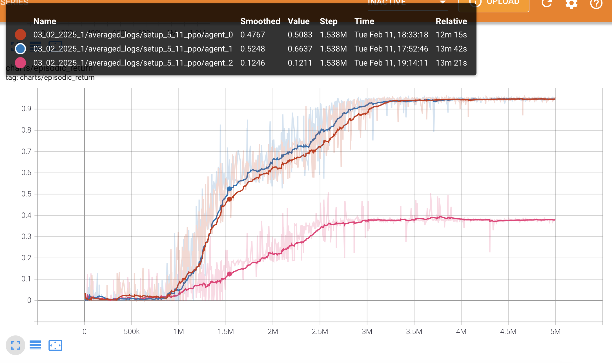
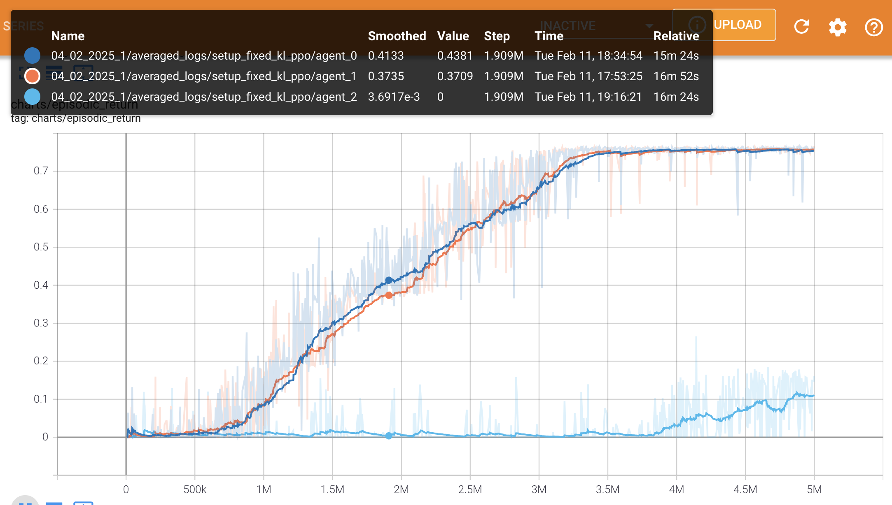
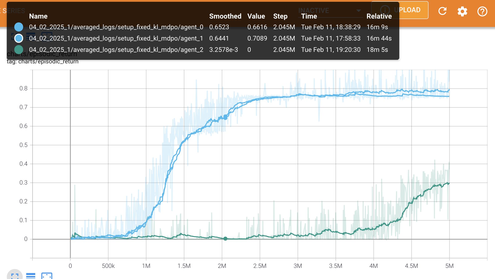

# Experiments

Описаны сетапы за последние две недели, т.к. предыдущие уже не актуальны.

1. 03_02_2025_1

Два агента коммуницируют, третий агент учится отдельно: либо с PPO, либо по MDPO. Усреднение по 5 сидам. Результат:

PPO:

MDPO:

**Замечание.** Обнаружили ошибку в подсчёте KL, пофиксили [здесь](https://github.com/RLHF-And-Friends/FedRL/commit/a42e06d3b850032b899a786ddbaa7c8bf9ed3496). Перезапускаем эксп (см. 04_02_2025_1).

2. 04_02_2025_1

PPO:

MDPO:

PPO и MDPO на одном графике (MDPO выше):

3. 04_02_2025_2

Такой же эксп как предыдущий, но с 10 сидами и на 10 миллионов итераций (x2).

4. 04_02_2025_3

5 миллионов итераций с 10 сидами в NoCustom-среде (предыдущие были в CustomSimpleCrossingS9N2-v0).

